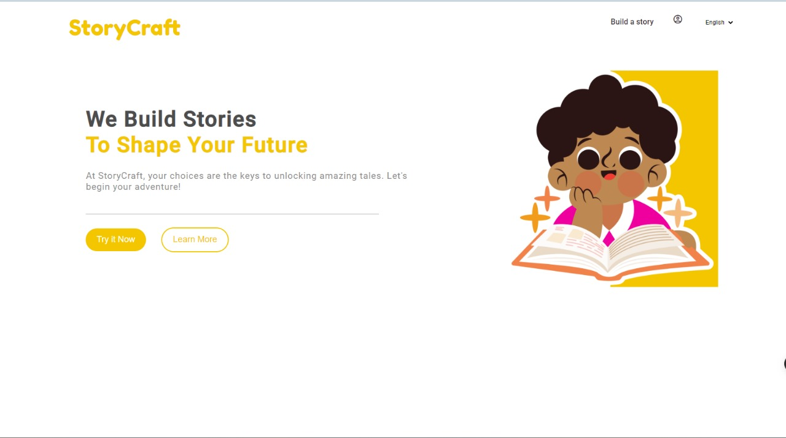
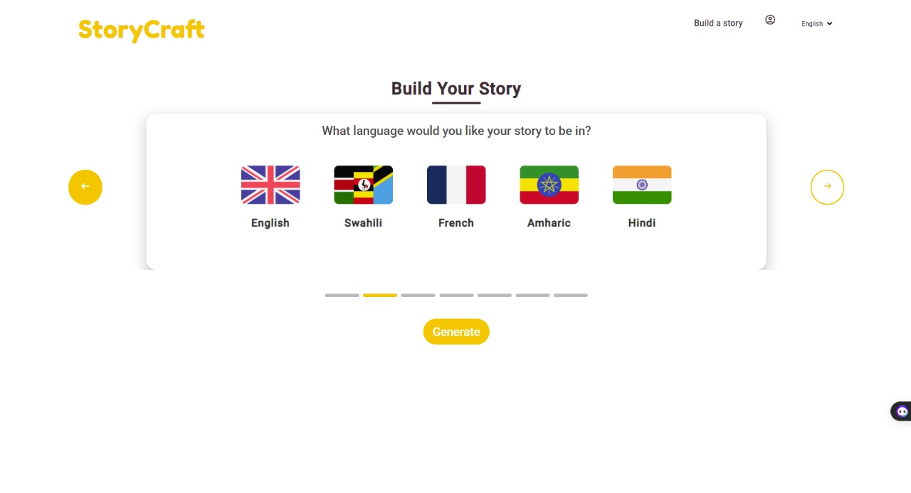
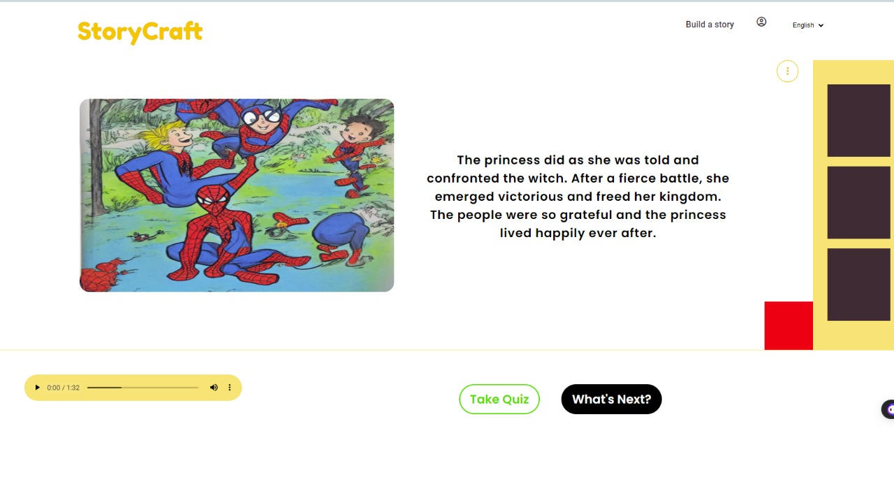

# 📖📖 StoryCraft: Nurturing Young Minds
This is an application that helps children improve their literacy, imagination and creativity at an early age. It does this by generating custom and personalized stories tailored to their age and understanding level

**Table of Contents**
1. [Introduction](#introduction)
2. [Features](#features)
3. [Installation Instructions](#installation-instructions)
4. [Usage Guide](#usage-guide)
5. [ScreenShots](#screenshots)
6. [Acknowledgements](#acknowledgements)
   
    
## Introduction
This project provides a solution to the problem of literacy among children. It was created to enhance reading skills among children, with the goal of improving their literacy and fostering a love for reading. The intended audience for this project is children of various age groups who are learning to read and their parents or caregivers.

## ✨Features
The features of this project include:
- User-friendly login and registration.
- Personalized story generation.
- Bookmarking favorite stories for later.
- Quick word look-up within the stories.
- Fun and educational quizzes.
- Sharing stories with friends and family.
- A leaderboard to track reading progress.
  
## Installation Instructions
To install this project, follow these steps:
1. Clone the repository from GitHub onto your local machine https://github.com/AsavaAsava/StoryCraft.git
2. Open the cloned directory with Visual Studio Code or any other code editor you prefer.
3. Run ```npm install``` command inside the root folder to install all dependencies required by the application.
4. Make sure that Node.js and npm are installed on your computer before running the above commands. You can download them from [nodejs.org](https://nodejs.org/)
5. You'll need an OpenAI account with access to GPT-3, and a Replicate account [replicate.com](https://replicate.com).
6. Replace `<your_openai_api_key>` in `.env` file with your own API key.
```
export OPENAI_API_KEY=XXX
```
7. Replace `<your_replicate_token>` in `.env` file with your own token.
```
export REPLICATE_API_TOKEN=XXX
```
## Usage Guide
Run flask in the git bash terminal
```
flask run
```
This will start the flask web server and you can access the application
## 📸 ScreenShots
|   |   |
|   |   |
## Acknowledgements
This project uses the following AI models:

- OpenAI API
- Stable Diffusion 
- GPT-3 by Anthropic
- ElevenLabs

Thank you to the teams at OpenAI, Stability AI, ElevenLabs and Anthropic for developing these powerful AI models and making them accessible.
